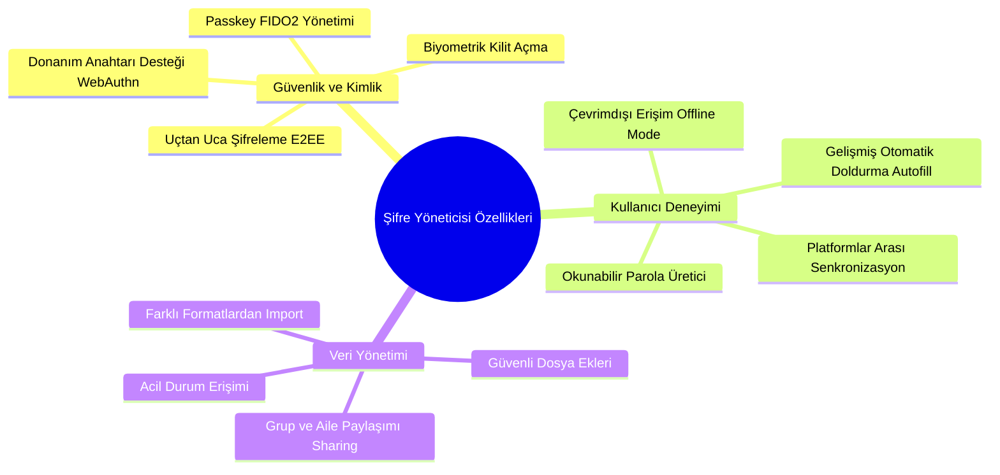

# VaultMaster Kapsamlı Şifre Yöneticisi Analiz ve Kıyaslama Raporu

Bu rapor, **VaultMaster** projesinin mevcut mimarisini inceleyerek; bir şifre yöneticisinde olması gereken modern özellikleri tanımlar, sektörü domine eden rakiplerle (Bitwarden, 1Password, Proton Pass, NordPass, Dashlane ve KeePass) kıyaslar ve VaultMaster'ı endüstri standartlarında bir ürüne dönüştürmek için eklenmesi gereken özellikleri detaylandırır.

---

## 1. VaultMaster Mevcut Durum Analizi

VaultMaster, modern şifre yöneticilerinin temel güvenlik ve işlevsellik gereksinimlerini karşılayan sağlam bir sıfır bilgi (zero-knowledge) mimarisine sahiptir.

*   **Uçtan Uca Şifreleme (E2EE):** Hassas veriler sunucuya gönderilmeden önce istemci tarafında (web ve tarayıcı eklentisi) rastgele üretilen bir Initialization Vector (IV) ile **AES-256-GCM** algoritması kullanılarak şifrelenir.
*   **Anahtar Türetme (KDF):** Master şifreden şifreleme anahtarı türetmek için **PBKDF2-SHA256** (varsayılan 600.000 iterasyon) kullanılır. Tuzlama (salt) işlemi kullanıcıya özel `kdfSalt` ile gerçekleştirilir.
*   **Güvenli Kimlik Doğrulama:** 2FA (İki Faktörlü Doğrulama) desteği olarak **TOTP** (Google Authenticator vb.) ve acil durumlar için **Kurtarma Kodları** (Recovery Codes) mevcuttur.
*   **Kasa Öğeleri & Yapısı:** Şifreler (Login), Güvenli Notlar (Secure Note), Kredi Kartları (Credit Card) ve Kimlikler (Identity) gibi temel tipleri barındırır. Klasörleme (Folders) ve Sık Kullanılanlar (Favorites) desteklenir.
*   **Güvenlik İzleme:** Kasa öğelerinde yapılan değişiklikler için sürüm geçmişi (`VaultItemVersion`), oturum yönetimi için cihaz bazlı yenileme jetonları (`Device`) ve denetim kayıtları (`AuditEvent`) tutulur.
*   **Şifre Sağlığı Analizi (Health Report):** Zayıf ve mükerrer şifrelerin lokal tespiti ile *Have I Been Pwned* API entegrasyonu (k-anonymity korumasıyla) sayesinde sızdırılmış şifre analizi yapılır.

---

## 2. Bir Şifre Yöneticisinde Olması Gereken Özellikler

Modern ve güvenli bir şifre yöneticisi platform bağımsız, hızlı, erişilebilir ve son derece güvenli olmalıdır. Sektörde bir şifre yöneticisinde aranan özellikler şu kategorilerde toplanır:

---

## 3. Sektör Liderleriyle Karşılaştırma Matrisi

Aşağıdaki tablo, VaultMaster'ın sektördeki köklü rakipleri karşısındaki durumunu göstermektedir:

| Özellik / Kriter | 1Password | Bitwarden | Proton Pass | NordPass | Dashlane | KeePass | **VaultMaster** |
| :--- | :---: | :---: | :---: | :---: | :---: | :---: | :---: |
| **Açık Kaynak Kod** | ❌ Hayır |  Evet |  Evet | ❌ Hayır | ❌ Hayır |  Evet | ** Evet** |
| **Kullanıcı Arayüzü UX** |  Mükemmel | ⚠️ Orta |  Çok İyi |  Çok İyi |  Mükemmel | ❌ Zayıf | ** Çok İyi** |
| **Self-Hosting (Kendi Sunucunu Kurma)** | ❌ Hayır |  Evet | ❌ Hayır | ❌ Hayır | ❌ Hayır |  Evet | ** Evet** |
| **Passkey (Geçiş Anahtarı) Desteği** |  Evet |  Evet |  Evet |  Evet |  Evet | ⚠️ Eklentiyle | **⚠️ Kısmi (şifreli kasa öğesi)** |
| **WebAuthn / YubiKey (Donanımsal MFA)** |  Evet |  Evet |  Evet |  Evet |  Evet | ⚠️ Eklentiyle | **❌ Hayır** |
| **Biyometrik Kilit Açma** |  Evet |  Evet |  Evet |  Evet |  Evet | ⚠️ Eklentiyle | **❌ Hayır** |
| **Şifreli Dosya Ekleri** |  Evet |  Evet |  Evet |  Evet |  Evet |  Evet (Lokal) | **❌ Hayır** |
| **Güvenli Kasa Paylaşımı (Ekipler/Aile)** |  Evet |  Evet |  Evet |  Evet |  Evet | ❌ Hayır | **❌ Hayır** |
| **Acil Durum Erişimi (Emergency Access)** |  Evet |  Evet | ⚠️ Beta |  Evet | ❌ Kaldırıldı | ❌ Hayır | **❌ Hayır** |
| **Maskelenmiş E-posta Entegrasyonu** | ⚠️ Fastmail | ❌ Hayır |  Evet | ❌ Hayır | ❌ Hayır | ❌ Hayır | **❌ Hayır** |
| **Diceware (Okunabilir Şifre) Üretici** |  Evet |  Evet |  Evet |  Evet |  Evet | ⚠️ Eklentiyle | **❌ Hayır** |
| **Çoklu Formatlardan İçe Aktarma** |  Evet |  Evet |  Evet |  Evet |  Evet |  Evet | **⚠️ Kısmi (CSV)** |

---

## 4. Rakip Analizi ve "Bunlarda Bu Var, Bizde de Olmalı" Değerlendirmesi

### A. Bitwarden & KeePass: Self-Hosting ve Açık Kaynak Gücü
*   **Rakiplerde Ne Var?** Bitwarden ve KeePass, verilerini üçüncü taraf bulut sağlayıcılarına emanet etmek istemeyen teknik kullanıcılara kendi sunucularını (Docker/Rust ile bitwarden_rs/vaultwarden) kurma veya tamamen lokal dosya tabanlı (KeePass `.kdbx`) çalışma imkanı tanır.
*   **Bizde Ne Olmalı?** VaultMaster'ın API ve Web bileşenleri Dockerize edilmeli ve kolayca self-host edilebilir hale getirilmelidir. Ayrıca, internet erişimi olmadığında eklenti veya web arayüzünün **IndexedDB** üzerinde şifreli lokal kilit (Offline Mode) açarak çalışabilmesi sağlanmalıdır.

### B. 1Password: Kusursuz UX ve "Travel Mode" (Seyahat Modu)
*   **Rakiplerde Ne Var?** 1Password, seyahat ederken sınır kapılarında cihazlarındaki hassas kasaları gizlemek isteyen kullanıcılar için "Travel Mode" sunar. Bu mod aktifken, sadece seyahat için işaretlenmiş kasalar cihazda kalır, diğerleri cihazdan tamamen silinir ve sınır geçildikten sonra tek tıkla geri yüklenir.
*   **Bizde Ne Olmalı?** VaultMaster'a **"Hassas / Güvenli Kasalar"** etiketi eklenerek, tek tıkla veya lokasyon/IP bazlı kurallarla belirli şifrelerin veya klasörlerin geçici olarak arayüzden ve lokal bellekten arındırılmasını sağlayan bir "Seyahat/Gizlilik Modu" eklenebilir.

### C. Proton Pass: Maskelenmiş E-posta (Email Alias) Entegrasyonu
*   **Rakiplerde Ne Var?** Proton Pass, kullanıcı yeni bir web sitesine üye olurken gerçek e-posta adresini gizlemek için tek tıkla `rastgele_isim@proton.me` veya `alias@passmail.net` gibi yönlendirmeli e-postalar üretir.
*   **Bizde Ne Olmalı?** VaultMaster tarayıcı eklentisi ve web arayüzü; ücretsiz ve açık kaynak kodlu email aliasing servisleri (örneğin **SimpleLogin**, **addy.io** veya **Firefox Relay**) ile API entegrasyonu kurarak, şifre oluştururken eş zamanlı olarak maskelenmiş e-posta oluşturabilmelidir.

### D. Dashlane & NordPass: Biyometrik Kilit Açma ve Donanım Anahtarları
*   **Rakiplerde Ne Var?** Tarayıcıyı veya bilgisayarı her açtıklarında 20 karakterlik Master Şifreyi yazmak istemeyen kullanıcılar için YubiKey, Windows Hello veya Touch ID entegrasyonları mevcuttur.
*   **Bizde Ne Olmalı?** WebAuthn standardı ve tarayıcı yerel API'leri kullanılarak, Master Şifrenin cihaz bazlı güvenli bir şekilde biyometrik doğrulamayla kilitlenip açılması (Biometric Unlock) sağlanmalıdır.

---

## 5. VaultMaster İçin Detaylı Yol Haritası ve Teknik Öneriler

### 🚀 Faz 1: Güvenlik Standartlarının Yükseltilmesi (Kritik)

#### 1. FIDO2 / WebAuthn Donanım Anahtarı (YubiKey) Desteği
*   **Amaç:** Giriş sırasında şifre avcılığı (phishing) saldırılarına karşı donanımsal 2FA koruması sağlamak.
*   **Teknik Uygulama:**
    *   API tarafına `@simplewebauthn/server` kütüphanesi eklenir.
    *   Veritabanında `User` modeline WebAuthn anahtarlarını saklamak için `authenticators` ilişkisi eklenir.
    *   İstemcide `@simplewebauthn/browser` ile tarayıcının güvenlik anahtarı arayüzü çağrılır.

#### 2. WebAuthn PRF Uzantısı ile Biyometrik Kilit Açma
*   **Amaç:** Master şifreyi sürekli yazmadan, parmak izi/yüz tanıma ile kasayı açmak.
*   **Teknik Uygulama:**
    *   WebAuthn **PRF (Pseudo-Random Function)** uzantısı kullanılarak, kullanıcının biyometrik doğrulaması sonucu işletim sisteminin TPM/Secure Enclave çipinden benzersiz bir entropi değeri alınır.
    *   Bu entropi, lokalde saklanan Master Key'i çözmek için simetrik anahtar olarak kullanılır. Böylece Master Şifre hiçbir zaman diske yazılmaz veya güvensiz bir şekilde saklanmaz.

---

### 🛡️ Faz 2: Kasa ve Veri Yönetimi Geliştirmeleri (Orta Öncelikli)

#### 3. Şifreli Dosya Ekleri (Encrypted Attachments)
*   **Amaç:** Pasaport taramaları, SSH anahtarları ve hassas PDF/görsellerin güvenle saklanması.
*   **Teknik Uygulama:**
    *   Prisma şemasına `Attachment` modeli eklenir (`id`, `vaultItemId`, `encryptedMetadata`, `fileUrl`, `size`).
    *   Dosyalar yüklenirken istemci tarafında rastgele bir **AES-GCM** anahtarı ile şifrelenir.
    *   Şifreli dosya içeriği S3 veya yerel nesne depolama (MinIO) üzerine yüklenir. Dosyanın şifre çözme anahtarı ise ilgili `VaultItem`'ın şifreli verisi içerisinde saklanır. Böylece sunucu dosya içeriğini asla göremez.

#### 4. Passkey (Geçiş Anahtarı) Saklama ve Doldurma
*   **Amaç:** Şifresiz giriş teknolojisine tam uyum sağlamak.
*   **Teknik Uygulama:**
    *   Tarayıcı eklentisindeki `content-script`, web sitelerindeki `navigator.credentials.create` ve `navigator.credentials.get` çağrılarını yakalamak için sayfaya `inject.js` enjekte eder.
    *   Eklenti arka planı (background script) WebAuthn isteklerini yakalar, kullanıcının onayını ister ve şifreli kasadaki FIDO2 kimlik bilgilerini kullanarak doğrulamayı tamamlar.

---

### 🤝 Faz 3: Sosyal ve İşbirliği Özellikleri (Uzun Vadeli)

#### 5. Asimetrik Şifreleme ile Güvenli Kasa Paylaşımı (Shared Vaults)
*   **Amaç:** Aile veya iş arkadaşları arasında şifreleri sunucuya sızdırmadan güvenle paylaşmak.
*   **Teknik Uygulama:**
    *   **Anahtar Çifti (RSA/ECC):** Her kullanıcı kayıt olurken istemci tarafında bir asimetrik anahtar çifti (Public/Private Key) üretilir. Private key, kullanıcının Master Key'i ile şifrelenerek sunucuya yedeklenir.
    *   **Klasör Anahtarı (Folder Key):** Paylaşımlı bir klasör oluşturulduğunda, bu klasöre özel simetrik bir `Folder Key` (AES) üretilir.
    *   **Erişim Yetkilendirme:** Klasöre bir kullanıcı eklendiğinde, o kullanıcının `Public Key`'i kullanılarak `Folder Key` şifrelenir ve DB'ye kaydedilir. Kullanıcı kendi Master Şifresi ile private key'ini çözer, onunla da `Folder Key`'i çözerek klasördeki tüm şifrelere erişim sağlar. Sunucu hiçbir anahtarı düz metin olarak göremez.

#### 6. Acil Durum Erişimi (Emergency Access)
*   **Amaç:** Kullanıcının başına bir şey gelmesi durumunda, önceden yetkilendirilmiş kişilere kasaya erişim hakkı tanımak.
*   **Teknik Uygulama:**
    *   Kullanıcı bir "Acil Durum Kişisi" ve bir "Bekleme Süresi" (örneğin 7 gün) belirler.
    *   Acil durum kişisinin Public Key'i ile kullanıcının Master Key'inin bir kopyası şifrelenir.
    *   Erişim talebi başlatıldığında, asıl kullanıcıya bildirim gider. Eğer bekleme süresi boyunca talep reddedilmezse, sistem şifreli Master Key kopyasını acil durum kişisine sunar.

---

### 🎨 Faz 4: Kullanıcı Deneyimi (UX) ve Kolay Kazanımlar

#### 7. Diceware / Passphrase (Okunabilir Kelime Grubu) Şifre Üretici — ✅ Tamamlandı
*   **Amaç:** Ezberlemesi kolay ama kırılması imkansız master şifreler üretmek (Örn: `elma-kamyon-mavi-kilit`).
*   **Teknik Uygulama:**
    *   ✅ `packages/crypto/src/password-generator.ts` içine kriptografik güvenli kelime listesi ve `generatePassphrase` API'si eklendi.
    *   ✅ Kullanıcıya kelime sayısı, ayırıcı karakter (tire, nokta vb.), büyük harf ve sayı ekleme seçenekleri sunuldu.
    *   ✅ Crypto testleri passphrase kelime sayısı, ayırıcı, büyük harf ve sayı seçeneklerini kapsayacak şekilde güncellendi.

#### 8. Gelişmiş CSV İçe Aktarma Şablonları — ✅ Tamamlandı
*   **Amaç:** Diğer şifre yöneticilerinden VaultMaster'a göçü saniyeler içine indirmek.
*   **Teknik Uygulama:**
    *   ✅ `apps/web/src/app/vault/settings/page.tsx` içindeki CSV içe aktarma mekanizması reusable `apps/web/src/lib/csv-import.ts` helper'ına taşındı.
    *   ✅ Bitwarden, 1Password, Dashlane, LastPass, Google Chrome, Mozilla Firefox ve VaultMaster CSV şablonları otomatik analiz edilip login alanlarına eşleniyor.
    *   ✅ Quoted alanlar, escaped quote, BOM, CRLF ve multiline notlar için CSV parser testleri eklendi.

---

## 6. Kalan Geliştirmeler İçin Paralel Uygulama Durumu

Kalan büyük özellikler güvenlik-kritik olduğu için bağımlılık sırasına göre dalgalara ayrıldı. Böylece farklı ajanlar aynı dosyalarda çakışmadan çalışabilir.

### Dalga 0 — Ortak Güvenlik Primitifleri — ✅ Hazırlandı
*   Prisma ve shared type/schema seviyesinde WebAuthn credential, attachment, passkey item, shared vault ve emergency access için ortak sözleşme hazırlandı.
*   Bu dalga feature davranışı eklemez; sonraki ajanların aynı veri modeli üzerinden paralel çalışmasını sağlar.

### Dalga 1 — Paralel Başlatılabilir
*   **Encrypted Attachments:** ✅ Vault item'a bağlı dosyalar tarayıcıda AES-GCM ile şifrelenip API'de yalnızca encrypted metadata/blob olarak saklanıyor; web edit akışında yükleme, listeleme, indirme ve silme desteği eklendi.
*   **Passkey Vault Item Type:** ✅ Web uygulamasında gerçek browser interception olmadan passkey kimlik bilgilerinin encrypted vault item olarak eklenmesi, düzenlenmesi, görüntülenmesi ve JSON yedek uyumluluğu tamamlandı. Extension interception kapsam dışı bırakıldı.

### Dalga 2 — Sıradaki Güvenlik Özelliği
*   **WebAuthn / FIDO2 MFA:** Mevcut TOTP 2FA desenini genişleten donanımsal/platform authenticator desteği.

### Dalga 3 ve Sonrası — Bağımlı Özellikler
*   **Biometric Local Unlock:** WebAuthn/platform authenticator altyapısı oturduktan sonra.
*   **Shared Vaults:** ✅ Davet/key-wrapping temeli tamamlandı: API owner/admin/member rol semantiğiyle paylaşımlı kasa oluşturma, listeleme, encryptedVaultKey daveti ve üye kaldırma destekliyor; web ayarlarında açık şifreli metadata/key input akışı var. Gerçek public key üretimi ve paylaşımlı item erişimi takip işi olarak kaldı.
*   **Emergency Access:** Shared vault/key wrapping temeli üzerine kurulacak.
*   **Extension Passkey Interception:** ⚠️ Kısmi — Extension artık page-world `navigator.credentials.create/get` çağrılarını güvenli bir inject script ile algılıyor, content/background hattında sender origin, page origin ve rpId doğrulaması yapıyor ve kullanıcıya açık rıza/uyarı mesajı gösteriyor. Otomatik credential oluşturma, imzalama veya passkey private-key kullanımı bilerek uygulanmadı; tarayıcının yerel WebAuthn akışı devam ediyor.
